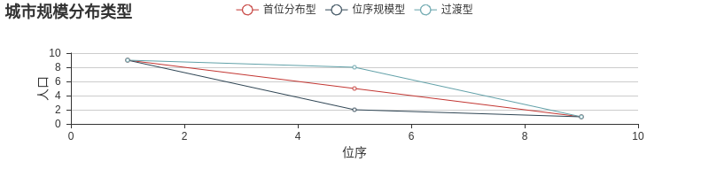
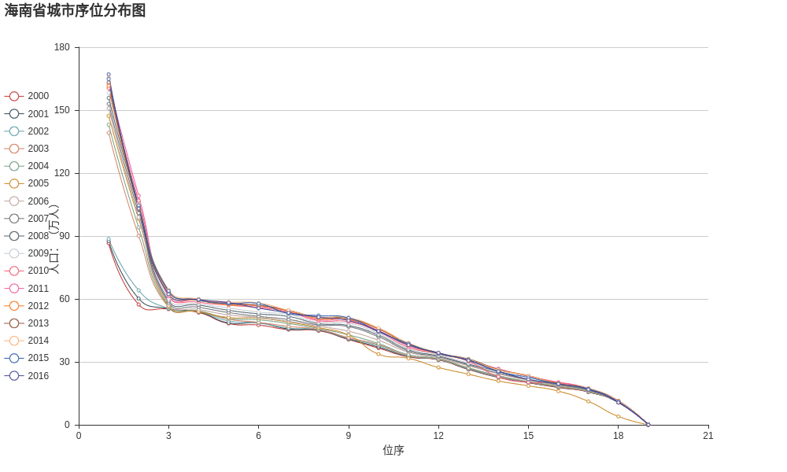

# 
海南省地级市序列规模分布研究

## 一、研究方法与数据

    

1. **采用城市规模分布模型**

+ 首位度指数:
        衡量城市体系规模序列结构常用的测度指数。包括：两城市指数（传统的城市首位度）、四城市指数和十一城市指数。
        计算方法如下：
        S2 = P1 / P2
        S4 = P1 / (P2 + P3 + P4)
        S11 = 2 * P1 / (P2 + P3 + ... + P10 + P11)

+ 位序-规模法则:
        根据城市规模和城市规模位序之间的关系来考察城市体系的规模分布规律。
        学术界将城市规模分布分为首位分布型、位序规模型和过渡型三种。
        如下图：

2. **数据来源:**  
    海南省，简称琼，省会海口。  
    目前，海南省行政区划内，辖4个地级市，8个市辖区，5个县级市、4个县、6个自治县（合计24个县级行政区划单位）、1个经济开发区。  
    4个地级市：海口市、三亚市、三沙市、儋州市;  
    5个县级市：五指山市、琼海市、文昌市、万宁市、东方市;  
    4个县：定安县、屯昌县、澄迈县、临高县;  
    6个自治县：白沙黎族自治县、昌江黎族自治县、乐东黎族自治县、陵水黎族自治县、保亭黎族苗族自治县、琼中黎族苗族自治县;  

+ **本研究数据取自知网海南省统计年鉴（2001年-2017年）人口篇目。**

## 二、海南省城市体系的规模序列结构特征

1. 根据前文提到的城市首位度指数计算方法，计算2000年-2016年的海南省城市体系的两城市指数（S2）、四城市指数（S4）和十一城市指数（S11），结果如下表表1所示：

|年份|2000|2001|2002|2003|2004|2005|2006|2007|2008|2009|2010|2011|2012|2013|2014|2015|2016
| :------:| :------:| :------:| :------:| :------:| :------:| :------:| :------:| :------:| :------:| :------:| :------:| :------:| :------:| :------:| :------:| :------:| :------:|
|S2|1.51|1.455|1.383|1.545|1.521|1.5|1.525|1.515|1.512|1.5|1.501|1.487|1.57|1.573|1.577|1.577|1.621
|S4|0.522|0.517|0.511|0.695|0.699|0.705|0.714|0.711|0.711|0.709|0.708|0.706|0.719|0.72|0.722|0.724|0.742
|S11|0.375|0.375|0.374|0.552|0.556|0.573|0.568|0.564|0.564|0.563|0.56|0.558|0.56|0.56|0.562|0.566|0.58

表1.海南省历年城市首位度指数

**分析：**按照位序-规模原理，理论上正常的二城市指数是2,四城市指数和十一城市指数是1。而从上表的结果来看，可以发现，从整体的角度来看，海南省城市的发展水平比较平均，首位城市与第二位城市的差距不大。但从发展的角度来看，省会海口的政治、经济引力随着历年的发展、国家政策的倾斜，使得各项指数不断地朝向正常值表动，整个海南省的城市规模分布在逐步向着良好的方向上发展。

2. 根据海南省历年各城市人口统计数据（见附图），绘制出海南省城市序列分布图，横轴表示城市位次，纵轴表示不同位次排名城市的人口数量（单位：万人），如下图所示：  

**分析：**对比前面学界总结的三种城市规模分布模型，可以发现海南省城市大致呈现位序规模型分布。首位城市于2002年～2003年间出现断崖式地增长并处于稳定地发展态势，然而两极分化严重，中小城市虽然有所发展，但这近二十年内没有太大的变化，在国家整体经济腾飞的大背景下，甚至可以说海南省中小城市发展停滞。

城市体系人口分布差异较大，城市规模分布分散，最大城市的垄断性较强，影响了城市体系整体功能的充分发挥。海南省的首位城市没能发挥较好的带领作用，自顾自地发展，脱离了周围城市的存在。这也表明一方面，城镇规模分布的集中力量大于分散的量，最大城市的垄断性不断加强;另一方面，海南省的规模分布在向更集中的规模结构方向演化，城镇规模发展趋势向正方向发展。

# 附图：

# 
**海南省城市人口统计图**

    

